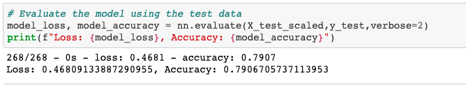
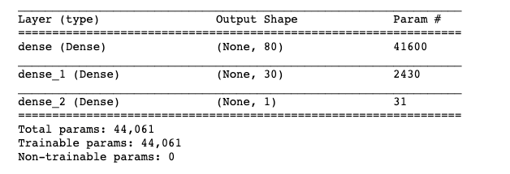

# Neural Network Charity Analysis

## Overview
Will applicants be successful if funded by the philanthropic organization Alphabet Soup? This loan prediction risk analysis was created by using TensorFlow to design a neural network, or deep learning model. A binary classification model was created to predict if an Alphabet Soup–funded organization will be successful based on the features in the dataset. 

Data source: CSV file containing more than 34,000 organizations that have received funding from Alphabet Soup. Within this dataset are a number of columns that capture metadata about each organization, such as the following:

* EIN and NAME—Identification columns
* APPLICATION_TYPE—Alphabet Soup application type
* AFFILIATION—Affiliated sector of industry
* CLASSIFICATION—Government organization classification
* USE_CASE—Use case for funding
* ORGANIZATION—Organization type
* STATUS—Active status
* INCOME_AMT—Income classification
* SPECIAL_CONSIDERATIONS—Special consideration for application
* ASK_AMT—Funding amount requested
* IS_SUCCESSFUL—Was the money used effectively

## Results
Once the number of neurons and layers in the model were set, the data was compiled, and the model was trained, an evaluation of the model’s loss and accuracy was achieved.

### Data Preprocessing
<b>What variable(s) are considered the target(s) for your model?</b> 
The target for the model is the "Is-Successful" column. It signifies if the money was use effectively.

<b>What variable(s) are considered to be the features for your model?</b> 
The features of this model are the NAME, APPLICATION_TYPE, AFFILIATION, CLASSIFICATION, USE_CASE, ORGANIZATION, INCOME_AMT,SPECIAL_CONSIDERATIONS, STATUS, and ASK_AMT

<b>What variable(s) are neither targets nor features, and should be removed from the input data?</b> 
The EIN had no bearing on the outcomes as this is just another type of index. The EIN is also number based and would confuse the model. SPECIAL_CONSIDERATIONS is not a target because there is only a small percentage of cases that had any special consideration. STATUS was not a target because all rows had the same value of 1.

### Compiling, Training, and Evaluating the Model
<b>How many neurons, layers, and activation functions did you select for your neural network model, and why?</b> 
In this model there are two hidden layers each with many neurons, that increased the accuracy above 75%. The first activation function was 'relu' and the 2nd was 'sigmoid' with the output layer set to 'sigmoid'. This training produces the highest accuracy.

<b>Were you able to achieve the target model performance?</b> 
Yes!

<b>What steps did you take to try and increase model performance?</b> 
Binning NAME and APPLICATION_TYPE returned a 79% accuracy rate as opposed to CLASSIFICATION and APPLICATION_TYPE with a 72% accuracy rate.

## Summary
A loan applicant has a 79% chance of being successful if they have the following:

* The NAME of the applicant is listed more than 5 times, meaning they applied more than once
* The APPLICATION_TYPE is either: T3, T4, T5, T6, T7, T8, T10, and T19.
* The CLASSIFICATION is: C1000, C2000, C3000, C1200, and C2100.

Comparing these results with another machine learning module like the Random Forest Model would be a good next step.

